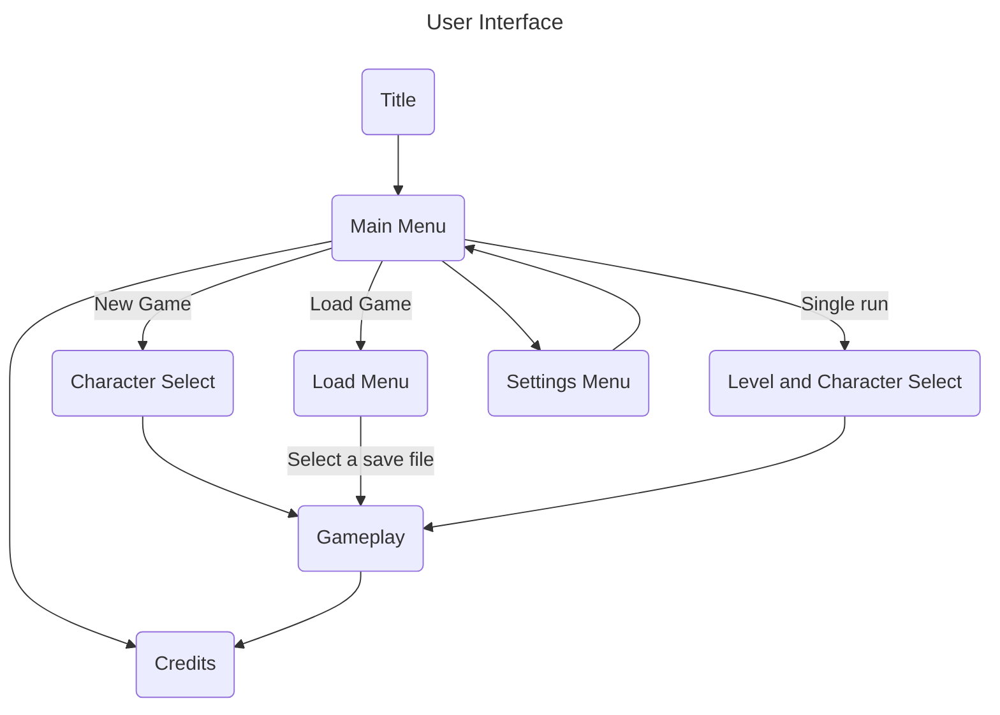

# Summary
Havoc is an arcade destruction game. Players take on the role of a kaiju and attack cities in a fully destructible environment.
# Game Design
**Havoc** combines the action of **Rampage** with the environmental detail of **Terraria**, players will be tasked with destroying a certain percentage of the city, and the faster they do so the more points they get. During the level, 
## Inspirations
![[rampage-screenshot.png]]
![[terraria-screenshot.png]]
- Rampage
	- Kaiju player
	- City levels
	- Unlockable characters
- Terraria
	- Destructable Environments
	- Character abilities, builds
	- Small tile sizes
## Environment
The levels will be tile based, the player's character will be some multiple of the tile size, this should give the player a good sense of scale, NPC characters will be one tile tall.  This is intended to give the player a sense of scale.
![[havoc-mock.png]]
# User Interface

