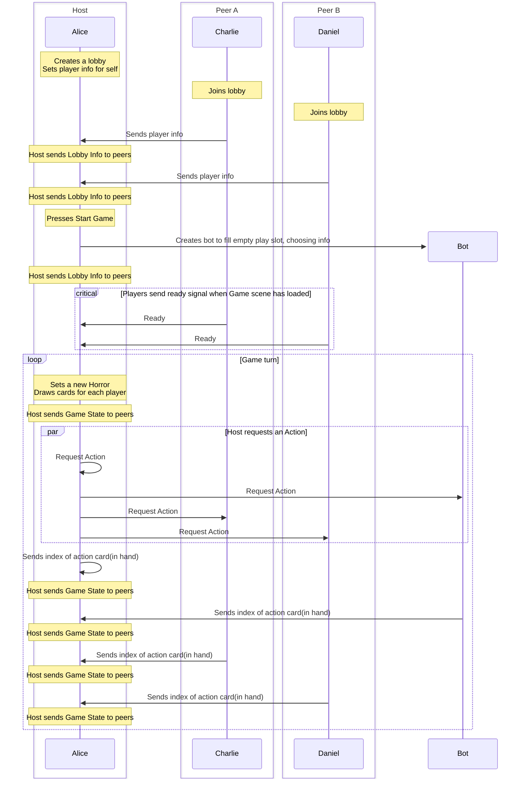

Multiplayer, my white whale.

So I've never made a multiplayer game over the network. Reason being is I don't often make games that would be good for it. Godscrown however feels like a big exception. I've started development work on it already, and have run into some hurdles. The biggest of which is all these ad-hoc functions that pass arbitrary data around. It's getting complex to really figure out what's going on here. I've got card effects that are going to be making this even more complex, so I need to start formalizing the protocol.

## Sequence Diagram.
I'm hoping that plotting this out can simplify the design and identify the functions and data I need to pass along. Here's what I have so far:

