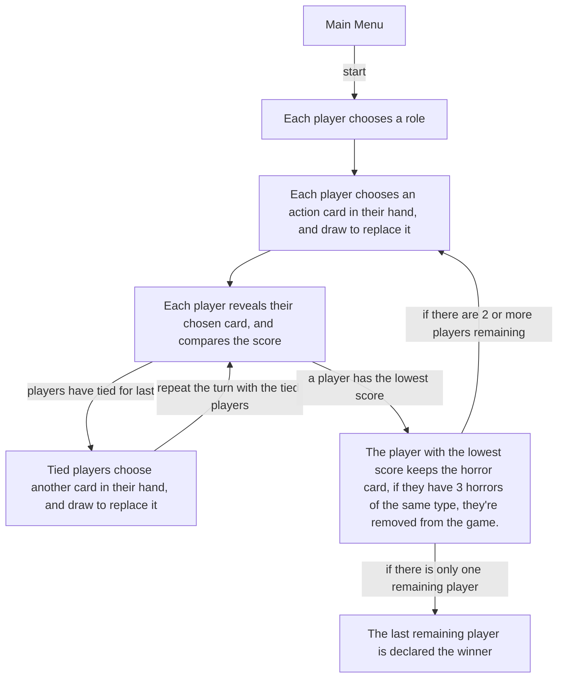

![[title.png]]
This game is for the [Cosmic Horrors Jam IV](https://itch.io/jam/cosmichorrorsjam4)! I'm writing this before the jam starts as I've already got an idea in mind that should be easy to develop, and let me flex some art skills along the way.

## The Plan
I'd like to create a game heavily inspired by [Happy Little Dinosaurs](https://unstablegames.com/collections/happy-little-dinosaurs/products/happy-little-dinosaurs-base-game), a very simple boardgame where you take your dinosaur character from one end of the board to the other, each turn facing a different disaster, and you use items to hopefully escape. I'll do some research on [[game-dives/happy-little-dinosaurs/index|Happy Little Dinosaurs, found here]]. Then I'll lay out how this game rethemes it and differs.

### Retheming
Disasters are **Horrors**, each a style of horror found in the cosmic horror genre.

Player characters are human, each representing a character within your typical film-noir story

Point cards and instant cards will be joined as **Action Cards**. An action card will have effects that can trigger in your hand, when played, during ties, etc.

## Rules

There are two decks, an Action Deck and a Horror Deck

The Action Deck contains 21 cards: a set of 7 point cards ranging from 1-7, 3 each.
The Horror Deck contains 20 cards: 
- 6 Arcane Horrors
- 6 Anomaly Horrors
- 6 Monstrosity Horrors
- 2 Cosmic Horrors (Which count as Arcane, Anomaly and Monstrosity)

There are three Roles players can choose from:
- Detective: +1 to Monstrosity Horrors, -1 to Anomaly Horrors
- Scientist: +1 to Arcane Horrors, -1 to Monstrosity Horrors
- Cultist: +1 to Anomaly Horrors, -1 to Arcane Horrors

At the beginning of the game, each player chooses a role and draws 3 cards.

At the beginning of a turn, a horror card is drawn from the horror deck and revealed to all players. Each player plays a card from their hand face down. Drawing a card to replace the card played. When all players have played their cards, they're flipped simultaneously, and the player with the lowest points takes the horror card.

Scoring: Each action card has a value associated with it ranging from 1-7, the player who played the card may also have a score adjustment based on their role. For example if a Detective is playing an action of 4 against a monstrosity horror, their total score is 5 due to the +1 to monstrosity detective has.

If two players tie for lowest score, they play a second card and score those as well. (Drawing to replace the card played as well). They repeat this step until the tie is broken.

If any player collects 3 of the same type of horror, they lose the game.

To win, you must be the last player in the game.
## Content
### Horrors
![[horrors.png]]
- Arcane (Knowledge based) Blue
- Anomaly (Reality based) Purple
- Monstrosity (Creature based) Red
- Cosmic (All Types) Gray

| Art | Type        | Name                | Note                                                     |
| --- | ----------- | ------------------- | -------------------------------------------------------- |
| Yes | Cosmic      | Star-Crowned King   | The skull on the card backs, but not skeletal.           |
|     | Cosmic      | Abyssal Queen       | Statue of Liberty, as an eldritch horror, still massive. |
| Yes | Arcane      | Maddening Device    | A touch screen phone, in the 1930s?                      |
| Yes | Arcane      | The Truth           | A big door, callback to full metal alchemist             |
| Yes | Arcane      | Impossible Equation | Just, literally the quadratic formula                    |
|     | Arcane      | Strange tablet      | Triangular tablet with glyphs on it                      |
|     | Arcane      | Sapphire Safe       | A source of ancient knowledge, in an unassuming bank.    |
|     | Arcane      | Experiment 23       | A living creature within a jar                           |
| Yes | Anomaly     | Eternal Twilight    | Eyeball in the night sky                                 |
| Yes | Anomaly     | Spatial Spirits     | A mysterious cocktail drink                              |
| Yes | Anomaly     | Slice of Life       | A person, a slice of a person, still living              |
|     | Anomaly     | Ouroboros Rail      | A train with no destination, no stop, and no start       |
|     | Anomaly     | Obsidian Vault      | A portal to unimaginable worlds, that calls people in    |
|     | Anomaly     | Times Square        | A point in space where multiple timelines converge       |
| Yes | Monstrosity | Grasping Smog       | Smoke rising from a vent causing people to go insane     |
| Yes | Monstrosity | The Birds           | Pigeons with too many eyes                               |
| Yes | Monstrosity | Pizzamalgam         | Pizza rat, but more tentacles                            |
|     | Monstrosity | Ruby Gargoyle       | A gargoyle with red gemstone eyes                        |
|     | Monstrosity | Living Vat          | A vat of chemicals brought to life                       |
|     | Monstrosity | Voidhoppers         | Living shadows reach out to take their hosts             |

### Characters
![[portriats.png]]

| Matrix       | +Anomaly       | +Monstrosity | +Arcane   |
| ------------ | -------------- | ------------ | --------- |
| -Anomaly     | Femme Fatale   | Detective    | Librarian |
| -Monstrosity | Fortune Teller | Ironworker   | Scientist |
| -Arcane      | Cultist        | Mob Boss     |           |
**Ending story**
The first slide of the ending should be shared by all characters, saving me time and effort

| The deck of horrors glows on the table, three bodies are seen lying on the floor around it. The ROLE watches, a tendril reaches out. | With the last card played the game ends. Your wish, ROLE, shall be granted. |
| ------------------------------------------------------------------------------------------------------------------------------------ | --------------------------------------------------------------------------- |
#### Detective
- Unlocks: **Mob Boss** (Turns into them)
- Wish: For no one to lie to them again.
- Result: The Star Crowned King gives them power, makes everyone fearful of them, and the detective becomes an eldritch mob boss. Monstrous underlings do his bidding

| Art                                                                                                                                       | Narrative                                                                                             |
| ----------------------------------------------------------------------------------------------------------------------------------------- | ----------------------------------------------------------------------------------------------------- |
| The detective writhes in pain at the table, suit starting to rip, the three bodies around the table start to glow                         | Power floods through your veins, fear becomes a currency. No soul will be brave enough to lie to you. |
| The Mob Boss stands at the top of a building looking down at the city, eldritch minions stand beside him                                  | All who cross you shiver. The city obeys your every command.  Mob Boss unlocked                 |

#### Scientist
- Unlocks: **Fortune Teller** (Turns into them)
- Wish: To know everything.
- Results: The Star Crowned King bestows upon them knowledge of all that has been, will be, and things that can never be. Her arcane knowledge is instead replaced with anomalous knowledge, turning her into the Fortune Teller

| Art                                                                                                                                                             | Narrative                                                                                                      |
| --------------------------------------------------------------------------------------------------------------------------------------------------------------- | -------------------------------------------------------------------------------------------------------------- |
| The scientist looks at the camera, eyes glowing, a tendril reaches from above and a swirl of eldritch knowledge rises up from the ground and surrounds her head | The Star Crowned King bestows upon you the knowledge of all that has been, will be, and all that can never be. |
| Eyes still glowing, the fortune teller now ponders an orb, with eldritch runes inside it                                                                        | Knowledge beyond time now guides your destiny.   Fortune Teller unlocked.                                |

#### Cultist
- Unlocks: **Librarian** (Turns into them)
- Wish: To please the Star Crowned King
- Results: The Star Crowned King would be happiest if this cultist simply didn't know of them at all. With their mind wiped, they become the librarian.

| Art                                                                       | Narrative                                                                                                                      |
| ------------------------------------------------------------------------- | ------------------------------------------------------------------------------------------------------------------------------ |
| The cultist sits with a glass in front of him                             | The Star-Crowned King bestows upon you a transformative mixture that will grant you charisma unbound                           |
| The Bartender places the glass down, emptied, the background is now a bar | A sip is all it takes to bend the willpower of all before you. Every heart opens before your words.  Bartender unlocked. |

#### Ironworker
- Unlocks: **Femme Fatale** (Revived by the star crowned king)
- Wish: To bring back someone who died in a construction accident
- Results: The Star Crowned King brings her back, but not as she was.

| Art                                                                                     | Narrative                                                                                   |
| --------------------------------------------------------------------------------------- | ------------------------------------------------------------------------------------------- |
| The Ironworker pleads with the deck, crying                                             | The Star‑Crowned King can bring back what was lost, but never as it was                     |
| A pale woman stands upon a construction site, claw marks on the steel where her hand is | She returns, not as she was, something new, something better.  Femme Fatale unlocked. |

### Actions

Each role will have their own set of Actions, each which have a *value*, a *name*, and optionally an *effect*.
#### Effects

| Name     | Effect                                                                           |
| -------- | -------------------------------------------------------------------------------- |
| Growth   | Each turn the card is in your hand, an amount will be added to the card's value. |
| Refresh  | When played, discards your entire hand and draws 3 new ones.                     |
| Stack    | When played, allows you to play a second card to add to the card's value.        |
| Critical | When played vs a specific horror type, a bonus is added to the card's value      |
| Breaker  | When played during a tiebreaker, a bonus is added to the card's value            |

## Technical

