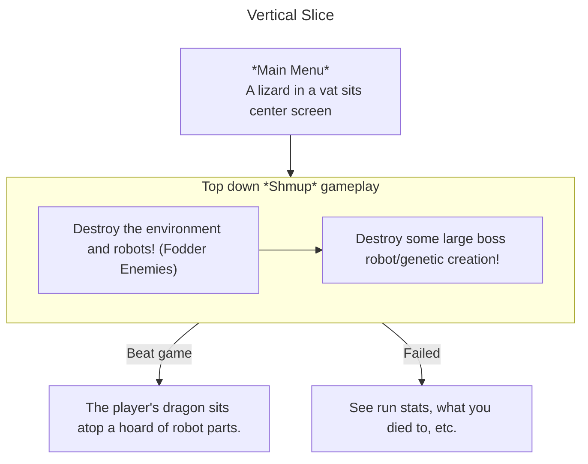

## SMUP Love Month Jam
This game has been in my head for a while now, but I've decided to go forward with getting a vertical slice done for the [SHMUP Love Month Jam](https://itch.io/jam/shmup-love-month-jam). 

## Story
While much of this *probably* won't be told to the player, I've felt having a good idea of the world of the game has let me fill in the mechanics and gameplay, so here's a tiny primer.

The player plays as a genetically engineered dragon. Created by a robot society in a project to revive extinct species, pulled from history books and stories. Humans have been long dead.

They came across depictions of dragons and mistook them for reality. The dragon breaks out of confinement and the laboratory they were created to wreak havoc on the surrounding city, and robots rush to stop it, sending hordes of robotic soldiers to shoot the dragon down.

### Setting
I picture the world as a very-futuristic world, where robots have inherited the earth, everything is fabricated, the whole world is a machine. "Nature" doesn't exist here. The dragon's destruction could be a sign of "nature" fighting back. If the player beats the game, grass could be shown sprouting from the destruction.

## Jam Scope
While *many* ideas might form in this document, I really only plan on making a single level for the jam. I have a feeling I'm going to spend *a lot* of my time just getting the visual style looking the way I'd like it to look. The gameplay I don't actually have any concern over. This is a jam I'm taking on purely to push my artistic skill, as [[2025-resolution|that's my goal for this year]].

### Mechanics & Gameplay
The player will play as a dragon, destroying a city ran and operated by robots. Robots and machines will attempt to stop the dragon, using guns and rockets initially. All bullets should be avoidable, and the player should only have a small health pool, dying in only a few hits. Bullet-Hell style gameplay.
#### Power Ups
Power ups will be dropped by enemies with a clear signal to the player, such as a flashing outline or distinct coloration. The powerups dropped could increase the attack speed or type, change the player's speed, add health, etc.  They can also be temporary or permanent (until the level ends)
#### Bosses
At the end of each level, the player will reach an open area or room, the camera would stop panning and the boss would be revealed, some larger threat the player would shoot at while dodging *lots* of bullets or other attacks. Winning these battles would require proper reactions to certain attacks and good positioning.

Bosses are creations of the robot society, and could be either much larger robots/tanks/machinery, or other genetic anomalies they've created in their labs.
### Visual Style
![[godzilla-hcw.png]]
[Godzilla: Half-Century War](https://wikizilla.org/wiki/Godzilla:_The_Half-Century_War) inspires the look of what I want to create here, with gradient coloring and hard black outlining work. From a technical standpoint, this means there's going to need to be some kind of outlining on objects and enemies, and a shader to create the gradients, to color them "flat" and ensure each frame of gameplay could look as though it's from a comic.

Strong typography should be used for displaying HUD information, to make it "pop out" of the screen, similar to how comic book panels are displayed.

Architecture of the levels should reflect a detailed tech look, as the civilization you're destroying as a dragon is one created by robots. Functional buildings, no nonsense, no art, no advertising. Things that would make sense to robots. It's not a "human" world
## Post-Jam Scope

### Story
It'd be really neat to expand upon the story, maybe add some fake-language text dialog for the robots, to *hint* at a story, giving robots lines when they're attacking, or when the dragon faces off against a boss. Some kind of unlockable cutscene system would be really neat too. Just being able to piece together this world as a reward would give the player a reason to try different builds and routes.
### Power Ups
I would *really* love to expand upon power ups, and make it more of a roguelite system of defeating bosses for some kind of currency, to then go spend on a power up shop, allowing the player to customize different dragon builds through powerups, and beat the game with certain chosen genes.
### Levels
I'd like to implement branching level paths, similar to Starfox 64, and depending on your choices, you'd face different bosses. This would ensure not every run has to be the same. Maybe Power ups could "unlock" different level paths, opening room for hidden endings.