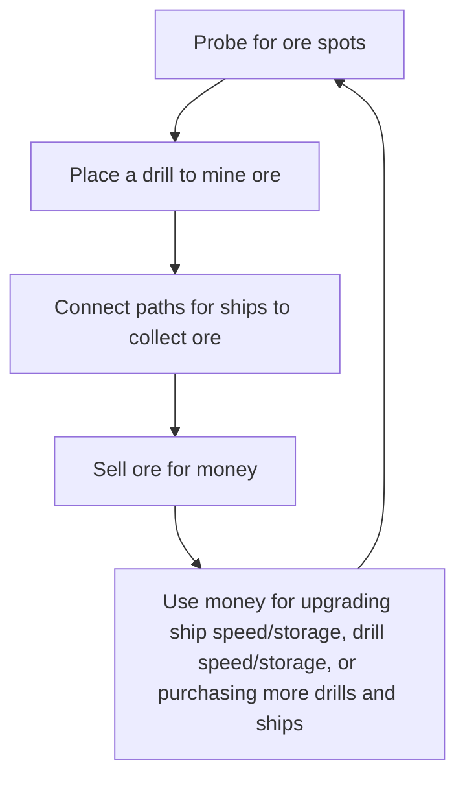
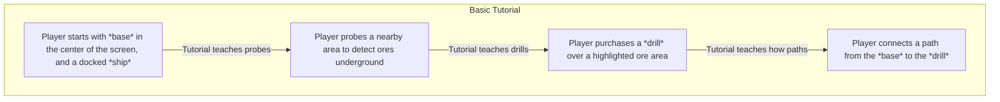

I have a love-hate relationship for incremental games. I feel like most of the time I don't know why I'm playing them because they feel like I'm skinner boxed into pressing a button every few minutes/hours/whatever. I want to try designing one to see what makes them work, and see if I can stretch the genre to be more engaging for me, personally.
## Inspirations
### Mini Metro / Mini Motorways
Manage subways/trains/cars efficiently by drawing paths between points, ensure everyone can get to where they're going quickly!

I really like the puzzle design and clear interface these games give you to manage things. Although I want path management, I think it's a good idea to limit options so players don't need to worry about being exactly correct about path placement., Mini Metro does a great job of that, and Mini Motorways as well, though it's much more about drawing efficient traffic routes. I plan on blending the two.
### ExoMiner
A classic incremental experience of mining resources to purchase upgrades to mine more resources until you hit enough points to leave... and do it all over again.

I'm not a big fan of waiting in this game, and the component/crafting mechanics wind up feeling pointless very quickly once you realize you can make loads of money off of simple to create things.

I think I'll keep the incremental gameplay simple, and *just* sell ore to purchase upgrades.
### Slipways
Manage trade routes while expanding a network of planets. keep your people happy and the money flowing!

This game features the exact vibe I want to have for this game. A meditative speed that can be beautiful to watch and the UI fits amazingly as well.

The probe feature and exploration is something I'd like to borrow. Not knowing *where* you'll expand really adds to the gameplay and it's something I want to have.

## Game loop

### Tutorial

## Mechanics
### Ships
The ships the player buys are basically space big rigs. They have a speed and storage stat, both of which can be upgraded. Storage will be in increments which will be displayed to the player as a trailer. The more storage a ship has, the more trailers will be trailing it. Speed will have a similar visual effect, which will be the amount and intensity of the thrusters it has
#### Upgrades

| Name  | Effect                                              |
| ----- | --------------------------------------------------- |
| Speed | How fast a fish makes their trip                    |
| Cargo | Amount of ore a ship can carry                      |
| Fuel  | Distance a ship can travel before needing to refuel |

### Drills
Drills are multifunctional, providing an area for ships to pick up cargo, as well as storing the ore they mine over time. They have a storage and speed stat.
#### Upgrades
- Speed
- Storage
#### Other thoughts

*Should drills run out of ore to mine over time? This would force the player to adjust drills, making no solution truly solved. Worth playtesting this.*
### Paths
Paths are what ships will follow continuously, picking up ore as they pass through drills and dropping it off when they reach a base. Paths can cross, which will lead to significant slowdowns in ship speeds, increasing the amount of time  a player has to wait to gain resources.