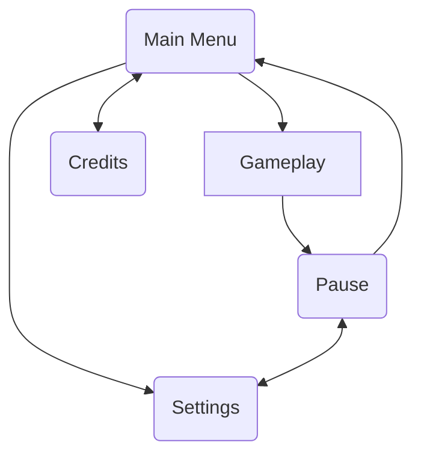

I wanted to take part in another game jam, to get even better at refining and playtesting a game. [One Game a Month #51]( https://itch.io/jam/one-game-a-month-51) seemed like a perfect proving grounds for me. It's a good enough time for me to push something out myself, and since it's non competitive, I can focus on just doing my best and not worry about the results.

I'm also going to try something with this page. The further you read on, the more technical and in-the-weeds things will get. I want to design from a high level downwards, to figure out the concepts I need to build for the game. The goal is to properly define these things before implementing them, so I have a clear idea of what I want to have at the end.

And another thing! This time I'll be following a schedule!

| Week | Description                                                                                                                                                                                                                                                                                                                                                                          |
| ---- | ------------------------------------------------------------------------------------------------------------------------------------------------------------------------------------------------------------------------------------------------------------------------------------------------------------------------------------------------------------------------------------ |
| 1    | **Writing this design document**! I want to get ahead of development, polish the idea, and have a complete idea of the game. This document of course will come with some edits as time goes on and development reveals things, but I want to have a solid plan starting out this time.                                                                                               |
| 2    | **Creating the prototype**! I want to create a quick prototype, no fully-developed assets (except those I can pull from existing projects or placeholders from free assets). I want to focus on *just* the mechanics of the game to ensure the design is solid                                                                                                                       |
| 3    | **Content**! I want to take those mechanics and produce as much content as I can with them. For example, spells, enemies, and equipment. This is *less* about the art part of the content, and more about the data those features work with. Testing out the limits of what the system can produce!  Near the end of this week, I should do a small playtest to gauge feedback |
| 4    | **Art/Assets**. This is time to polish. Make art and assets, give the game an overhaul in visuals, and make everything cohesive.  Near the end of this week, I should do a second small playtest, and check results                                                                                                                                                            |
| 5    | **Feedback, Iterations, Playtesting, Bugfixes**. This last week only has three days in it, it should be filled with polishing up the last bits, and playtesting it extensively to ensure the game is as good as I can make it.                                                                                                                                                       |
## Overview
The theme for this jam is **Collectible**. As a Magic the Gathering player I've taken this to mean **Cards**.  Because one of the games I want to make is a [[game-ideas/mystery-dungeon/_index|Mystery Dungeon]] styled game, I think I'll take on making a roguelike for this, as they're well suited for game jams (because they're single-run) and I could easily reuse code for the mystery dungeon, or worst case scenario, I'll learn what to avoid in the future.

So, how do I mix *cards* with *roguelike?* Cards will act as spells the player can pick up. They'll be one-time-use and held by enemies who will *also* use cards. The player's goal will be to reach as far as possible into a randomly generated dungeon, and their cards will continuously change over time as they're forced to adapt to the cards they pick up.
### Pitfalls
If I'm not careful, there's a lot of pitfalls that can make this game feel bad. Roguelikes are kind of notorious for feeling unfair, and I want to avoid that as much as possible. The concept of items being important also has some typical issues found in RPGs that I need to design around. I'll likely come back to this in the following weeks to add on as I discover more pitfalls with this initial design, and work out what potential solutions I can think out.
#### Player hoards cards
A common problem with items in RPGs is that players want to hoard them *just in case*. Problem is, just in case never happens and this tactic is *boring*. The player needs to be incentivized to use cards. Here are some options that should be explored during prototyping
- Only allowing X amount of cards to be carried at a time or through dungeon floors
- Having cards decay over time, allowing the player to carry them for longer, but eventually they'll be weaker, less valuable, or fade entirely.
- Include a shop system to allow the player to sell cards at a significant loss, but buy cards of their choosing. Hoarded cards would get sold away for specific builds the player wants to play with. **This goes well with the collectible theme, as one of the big things that comes to mind when I think of collectibles is the third party market wizards likes to abuse**
#### Player has no cards
A player with no cards would have no good abilities. This *could* be a death sentence, especially early game, depending on how bad RNG can be if I'm not careful. I can think of a few options to avoid this.
- Always allow a "basic attack", like in Pokemon Mystery Dungeon, some kind of tackle-like attack is always available at close range.
- Ensure the "tutorial" sets the player off with *some* cards. Dead Cells starts the player off with a couple basic weapons and maybe that's a good hint for this kind of thing. At least, after the player knows how to use them. There should absolutely be a tutorial boolean to allow players to toggle off the initial tutorial.
## Gameplay
### Menus
I need to provide the player with some basic menus, allowing them to access settings, pause the game, etc.

### Tutorial
I'm going to need to teach the player a few things in the following order
1. How to move
2. What an enemy looks like, and how to read its current status.
3. How to avoid an enemy attack, and how to read the turn indicator
4. How to attack an enemy
5. What a card is, and how to pick it up (by walking over it)
6. How to use a card
7. What a dungeon exit looks like
8. How a shop works
9. What the goal is (to get as deep as possible)
### UI
#### Turn indicator
All units visible should display their actions in the turn indicator. The player should be able to hover over each item in the indicator to highlight which enemy's actions they're looking at. This indicator should advise the player when it's safe to attack and how long they have before a certain attack happens.
#### Map
As the player explores the dungeon, I don't want them to get lost and wander around in circles. The map should make it clear where the player hasn't been and where they might need to go next. Some cards may also reveal the map, aiding in exploration! The map *might* also be able to display enemies, or maybe that can be a card too.
#### Player Status
The player will need to know their current health, buffs, and debuffs. It would also be beneficial to show the current dungeon floor so that they may know how deep they've got so far!
#### Enemy Status
The player will need to know how much health an enemy has, if they're casting a spell, and any buffs/debuffs they may have. this might be nice to display via icons above or below the enemy.
#### Cards
The player needs to be aware of what cards they have, and how to use them. I *think* a simple button press to bring up a dropdown should do the trick. The player could utilize either keyboard commands *or* their mouse to select an item and target.
### Dungeon
The dungeon will be generated with a spelunky-like system. They'll be far more open than a traditional roguelike, and this is to allow for interesting spells to be used to their maximum effect. I don't want the player to be trapped in long boring hallways. I want to ensure each portion of the dungeon is visually identifiable enough so the player doesn't spend time running in circles.
### Combat
#### Turn Economy
A based turn economy is ideal. Some actions can take multiple ticks, while walking might only take one. This *should* allow the player to avoid some of the nastier attacks, so long as they're not also in the middle of casting.
#### Cards
Cards can have a variety of effects, not just combat-based ones. This should allow for the most flexibility in gameplay
#### Enemies
Enemies will be the *exact* same type as the player. They have cards and will be able to use them to attack the player *or* other enemies. I just think more interaction than just "everyone's after the player" is way more interesting. Make it feel like a free-for-all which might be ideal for certain scenarios.
### Shops
Shops will be provided between dungeon floors, to allow the player to move freely and make decisions without worrying about enemies coming up while they're in the middle of trading away their cards for something big.

## Visual Style
I'll be doing this all in 3D, top down. I want to utilize lighting and shadow, and I want to make the player have visibility similar to most other roguelikes.

I'm *unsure* if I want to use perspective or orthographic. I find perspective to look more modern, which can be nice, but orthographic might be nicer if I want to use my 3D-pixel-art-like style I've been refining. *that said*, that style is not quick or easy to pull off... I should shoot for easy, right now, and I'm unsure of how to go about post-processing colors to match a palette to really make it feel right. *if* I have the time near the end I can try converting assets to that, but it's unlikely.

This is all very likely something I should think more of in week 3, for now though, all of this can be prototyped with what I have already.