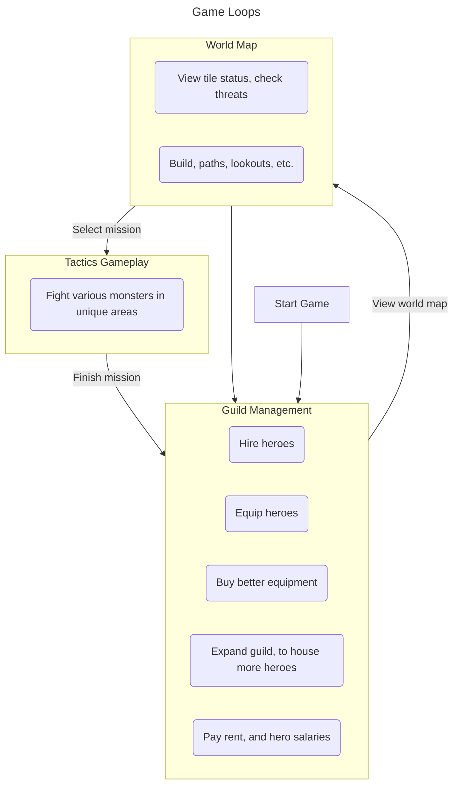

The following is a rough idea for a game I've had stuck in my mind for a while now. I want to refine this document to give me a clear idea of the game I want to build. I've *attempted* to build this game a few times now, being stopped due to **skill issues** such as not having the art skills to put it together.

You could say this is my *dream game*. Much of the idea of this game is *probably* still in my head. Got any questions about it? Let me know!
## Overview
Guilds of Vaedria is a game that combines the character-driven storytelling of RimWorld with the tactics gameplay of something like Fire Emblem.
## Plot & Setting
Vaedria is a single continent, where life had been calm and quiet for as long as anyone could remember. The people there had learned how to live off of the land ages ago, and generally kept to themselves. 

The world had been corrupted by some unknown magical force. Magic is a new addition to the world, and people have only barely scratched the surface of how to utilize it, and not everyone agrees it's something to learn. 

The magical force has fractured communities, and has forced every settlement into isolation. The goal of the player is to reunite Vaedria, unlocking regional-specific abilities and heroes as they reach each settlement.
## Key Pillars
### Characters should feel real
> Given the opportunity, players will optimize the fun out of a game - Someone smart, possibly Sid Meier, Soren Johnson

There are many, many variables to most tactics games, but still players will figure out the "optimal strategy" to winning most fights. I *don't* want the player to stick with one perfect team and never bother interacting with different playstyles, team compositions, and abilities. 

To avoid this, heroes will be treated like people. They will have things they prefer, so using a particular hero properly means buying and equipping them with items that the character wants, not the player. Building a team that works well together will require sending them out together, and learning how they interact. Over time, opinions between characters will form and it's up to the player to manage those players to ensure their heroes are happy.

Of course, a long enough gameplay with enough heroes and enough money, players will eventually find a team that works well together, but that team will be formed randomly based on the heroes they've come across, and no two runs should be similar.
### Endless gameplay
An ending *is* possible, but I feel that it should be the player's choice. 
## Game Loops
The game puts the player in a guild management position, where they have to balance the cost of their guild and heroes with the income they get from missions. There's an emphasis on heroes and their personalities, some heroes may have likes and dislikes of other heroes, as well as preferred weapon types and opinions on magic. Keeping them happy will keep their costs down!

## Inspirations
### Advance Wars / Wargroove
These games are my favorite tactics games/series of all time. Neither of them have characters that feel real though, units are simply that, units. A death doesn't matter, and pumping out more is a simple menu away. But I do find the tactics gameplay itself very engaging, the rock-paper-scissors situations you can find yourself in where no one type of unit can steamroll the opponent. 
### RimWorld
Every character feels real, from the other factions to even the animals and monsters you face. Every run feels unique and the player can choose to play as long as they like, so long as they have colonists. The combat leaves much to be desired though, at times it feels very RNG and unfair.
### XCOM 2
A tactics game where every unit definitely feels unique, but not in a real way. Units level up and grow, but they're still just units. No one feels like they have any real personality. Permadeath definitely hits hard regardless though, since new units come in at a low level, it takes quite a while before anyone is as skilled as veteran units.
### Monster Hunter
Progression in Monster Hunter is more about equipment (and learned skill), and I find that to be a lot more engaging than rolling stats up for characters. I'd like to borrow this progression for this game.