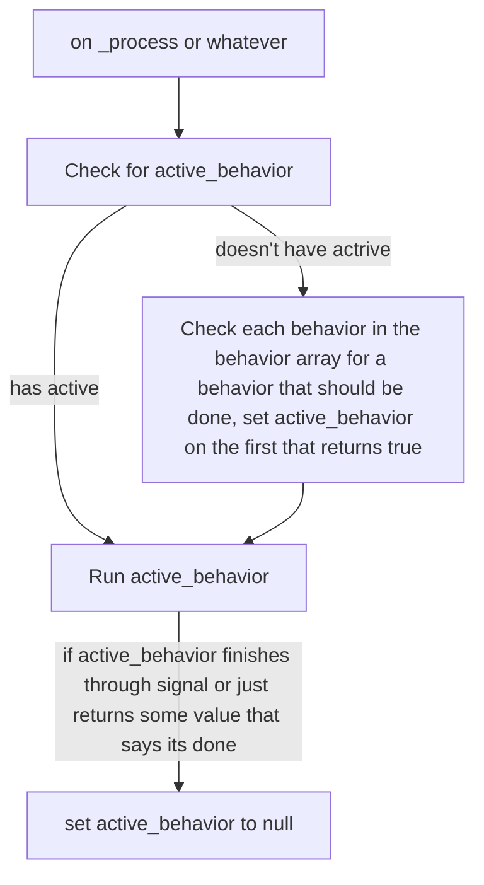

```mermaid
flowchart TD
	
	process["on _process or whatever"]
	check_active["Check for active_behavior"]
	run_active["Run active_behavior"]
	get_active["Check each behavior in the behavior array for a behavior that should be done, set active_behavior on the first that returns true"]
	active_done["set active_behavior to null"]
	process --> check_active
	check_active -- has active --> run_active
	check_active -- doesn't have actrive --> get_active
	get_active --> run_active
	run_active -- if active_behavior finishes through signal or just returns some value that says its done --> active_done
	
```
